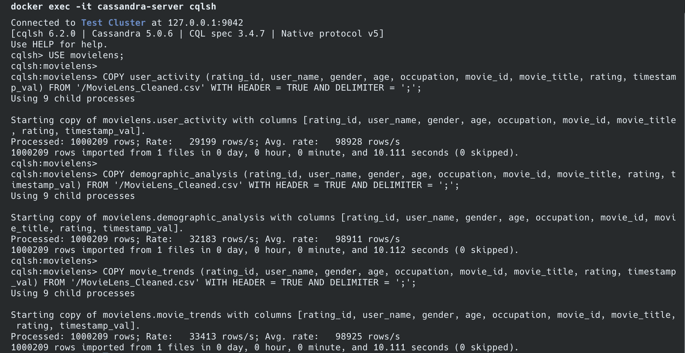
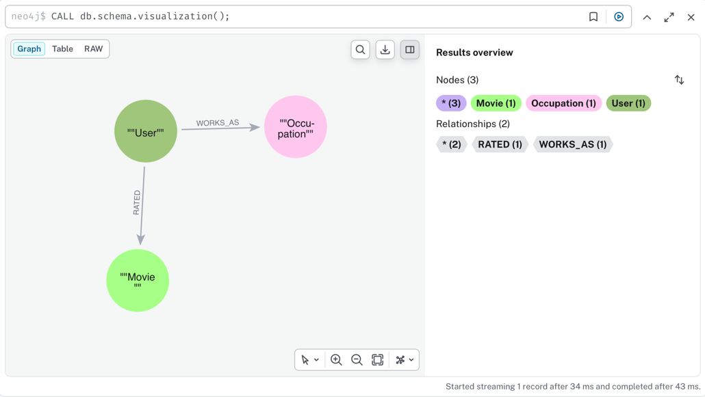
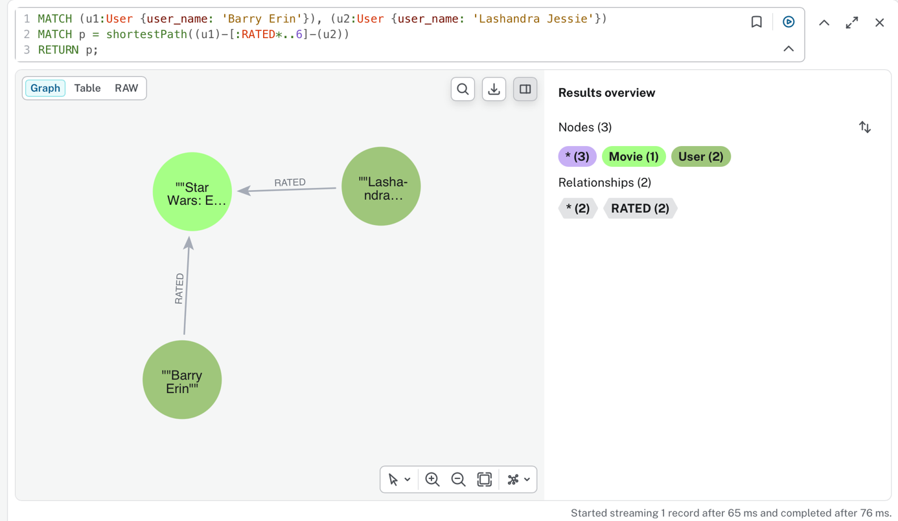

# MovieLens NoSQL: Cassandra vs Neo4j

The same dataset of **1,000,209 movie ratings** (MovieLens 1M) modelled twice: as **query-first denormalised tables in Apache Cassandra**, then as a **property graph in Neo4j**, with queries ranging from single-partition reads to collaborative filtering, APOC path expansion and shortest paths.

School project (NoSQL databases course, ESILV, March–April 2026). The scripts were rebuilt from our project reports, then re-run end to end with Docker (September 2026): same row counts, graph size and query results as our original runs.

[](https://github.com/Oradixx/movielens-nosql/actions/workflows/e2e.yml)


## Pipeline

```
MovieLens_ratingUsers.json ──► scripts/clean_data.py ──► MovieLens_Cleaned.csv ──┬──► Cassandra: 3 tables (cqlsh COPY)
   (1 JSON document per rating)      (flatten, stream)       (';'-separated)      └──► Neo4j: graph (LOAD CSV)
```

## Part 1: Cassandra, one table per query

In Cassandra, a query must hit a partition key, so the model starts from the queries. The same rows are written to three tables:

| Table | Partition key | Clustering columns | Answers |
|---|---|---|---|
| `user_activity` | `user_name` | `movie_id` | the full history of a user, or some of their movies |
| `demographic_analysis` | `occupation` | `gender`, `age`, `user_name`, `movie_id` | ratings by job, then gender, then age |
| `movie_trends` | `movie_title` | `rating DESC`, `timestamp_val DESC`, `user_name` | best and latest ratings of a movie |

- **Import**: each table loads the 1,000,209 rows in about 10 s with `cqlsh COPY` (~99,000 rows/s, single node).
- **Queries** ([`cassandra/03_queries.cql`](cassandra/03_queries.cql)): user history, `IN` on a clustering column, filters that follow the clustering order (occupation → gender → age), a movie's most recent 1-star ratings, `COUNT`.
- **User-defined aggregate**: `AVG()` on an `int` column returns an `int` (the lawyers' average came out as **3**, while the mean computed from the CSV is about 3.62). We wrote a Java UDA, `true_average`, with a state function (count + sum) and a final function (division). It gives 4.3158 for *The Matrix*.

<p align="center"></p>

## Part 2: Neo4j, a property graph

```
(:User {user_name, age, gender})-[:WORKS_AS]->(:Occupation {name})
(:User)-[:RATED {rating, timestamp_val}]->(:Movie {movie_id, title})
```

- The occupation is a node, so users can be grouped by job by traversing the graph.
- **Uniqueness constraints** on the user name, movie id and occupation, which also create the indexes used by `MERGE`.
- **Import**: `LOAD CSV` + `CALL { … } IN TRANSACTIONS OF 10000 ROWS` + `MERGE` (idempotent). It created 9,642 nodes and 1,003,393 relationships in about 40 s.

| Level | Queries ([`neo4j/`](neo4j)) |
|---|---|
| Simple | multi-node filters, `CONTAINS`, filters on relationship properties, implicit grouping, a 3-hop pattern, `WITH` as `HAVING` |
| Complex | collaborative filtering ("fans of *The Matrix* also loved…"), top 3 movies per profession with list slicing, **map projections** exporting nested JSON profiles, the list predicate `ALL()` |
| Advanced | **APOC** `apoc.path.subgraphNodes` (a user's network up to 3 hops), **KNN-style recommendation** (50 nearest users, weighted score), `shortestPath()` between two users |

Some results: *Star Wars IV* (796 shared 5-star fans) and *Star Wars V* (682) are the top recommendations for *Matrix* fans. *American Beauty* is the most rated movie (3,392 ratings in the graph). The two users compared with `shortestPath()` are only 2 hops apart, through a movie they both rated.

<p align="center">
  
  
</p>

## What we learned: a data quality issue

The course dataset has **no user id**, only generated names, so both databases use `user_name` as the key. But names are not unique:

- The 6,040 MovieLens users map to only **5,915 distinct names**, and at least **123 names** are shared by users with different profiles (age, gender or job).
- When two users with the same name rated the same movie, the rows collide. Cassandra keeps the last write (upsert) and Neo4j `MERGE` keeps one relationship: **2,847 ratings** collapse, which is why the graph counts 3,392 ratings for *American Beauty* instead of 3,428.
- Merged "users" look like super-raters: the most active name has 2,432 rating rows because it mixes several people.

The fix would be a synthetic user key built from `(user_name, gender, age, occupation)`, or the original `UserID` from MovieLens.

Other limitations:
- `demographic_analysis` has only 21 partitions (one per occupation), of very uneven sizes.
- Some titles have encoding errors inherited from the source file (e.g. *Der Himmel �ber Berlin*).

## Run it

Requires Docker (or OrbStack) and Python 3.

```bash
git clone https://github.com/Oradixx/movielens-nosql.git
cd movielens-nosql

# 1. Data: put MovieLens_ratingUsers.json in data/raw/ (see data/README.md), then
python scripts/clean_data.py

# 2. Start Cassandra and Neo4j (+ APOC); --wait returns once both are healthy (~1 min)
docker compose up -d --wait

# 3. Cassandra
docker compose exec cassandra cqlsh -f /scripts/01_schema.cql
docker compose exec cassandra cqlsh -f /scripts/02_load.cql
docker compose exec cassandra cqlsh -f /scripts/03_queries.cql

# 4. Neo4j (Browser at http://localhost:7474, user neo4j / password movielens)
for f in 01_constraints 02_load 03_simple_queries 04_complex_queries 05_advanced_queries; do
  docker compose exec neo4j cypher-shell -u neo4j -p movielens -f /scripts/$f.cypher
done
```

## Tests

The course dataset is not redistributable, so CI ([`e2e.yml`](.github/workflows/e2e.yml)) runs the whole
pipeline on a **synthetic sample** in the same format ([`tests/make_sample.py`](tests/make_sample.py)):
JSON → CSV → Cassandra and Neo4j → every query script. [`tests/check_results.py`](tests/check_results.py)
then compares what each database returns with values computed straight from the CSV: row and node counts,
the `true_average` aggregate, and the duplicate-name collision (two different users called *Alex Twin* end up
as one `User` node).

To run it locally without the course file, replace step 1 with the first line below, then run the check after step 4
(the sample goes to `data/raw/sample_ratings.json`, next to the real file, never over it):

```bash
python tests/make_sample.py && python scripts/clean_data.py data/raw/sample_ratings.json
python tests/check_results.py
```

## Structure

```
├── scripts/clean_data.py      # JSON → CSV
├── cassandra/                 # schema, COPY import, queries + UDA
├── neo4j/                     # constraints, LOAD CSV import, simple / complex / advanced queries
├── tests/                     # synthetic sample + result checks (run in CI)
├── docker-compose.yml         # Cassandra 5.0 (UDFs enabled) + Neo4j 5 (APOC)
├── data/                      # not included, see data/README.md
└── docs/images/               # screenshots from the original runs
```

## Authors

- **Clément Vurpillot** — [@Oradixx](https://github.com/Oradixx)
- **Marwan Hemani**
- **Noé Spychala**

Data: MovieLens 1M, from [GroupLens](https://grouplens.org/datasets/movielens/). F. Maxwell Harper and Joseph A. Konstan. 2015. *The MovieLens Datasets: History and Context*. ACM Transactions on Interactive Intelligent Systems 5, 4.
